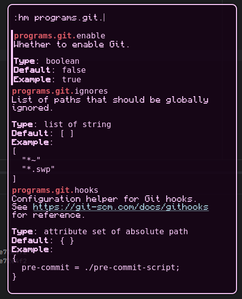

# anyrun-nixos-options

## This is a fork from n3oney/anyrun-nixos-options
I do not own or am associated with any of this code, i simply bandaid fixed and updated it for my personal use <3

All credits to https://github.com/n3oney/anyrun-nixos-options

An anyrun plugin that lets you search NixOS options.

# how 2 build?

`nix build` or `cargo build` in the devshell (`nix develop`)

# Configuration (Home Manager)

Under home manager, you configure this plugin the same way you would any other anyrun plugin

In your anyrun config :

```nix
programs.anyrun = {
    # your other anyrun options
    
    extraConfigFiles."nixos-options.ron".text = let 
        # fetch the option jsons locally
        nixos-options = osConfig.system.build.manual.optionsJSON + "/share/doc/nixos/options.json";
		hm-options = inputs.home-manager.packages.${pkgs.system}.docs-json + "/share/doc/home-manager/options.json";
    
        # assign prefixes to them
        options = builtins.toJSON {
			":nix" = [ nixos-options ];
			":hm" = [ hm-options ];
		};
	in ''
	    Config(
	        options: ${options},
	        
	        // Optional (these are the defaults):
            min_score: 0,
            nixpkgs_url: "https://github.com/NixOS/nixpkgs/blob/nixos-unstable", 
            max_entries: 5,
            strict_matching: false,
            url_color: "lightblue",
            file_color: "lightgreen",
            match_color: "#db5a65"
        )
	'';
};
```

# Configuration (Non-HM)

Create your `nixos-options.ron` file in the anyrun config directory :

```ron
Config(
    // You can obtain NixOS's options.json by running `nix build .#nixosConfigrations.<name>.config.system.build.manual.optionsJSON` in your Flake directory
    options: {":nix": ["/path/to/options.json"]},
	        
	// Optional (these are the defaults):
    min_score: 0,
    nixpkgs_url: "https://github.com/NixOS/nixpkgs/blob/nixos-unstable", 
    max_entries: 5,
    strict_matching: false,
    url_color: "lightblue",
    file_color: "lightgreen",
    match_color: "#db5a65"
)
```

# Usage

Search for any option in the docs by typing the prefix then the option

Uses either fuzzy matching or strict matching depending on the config

